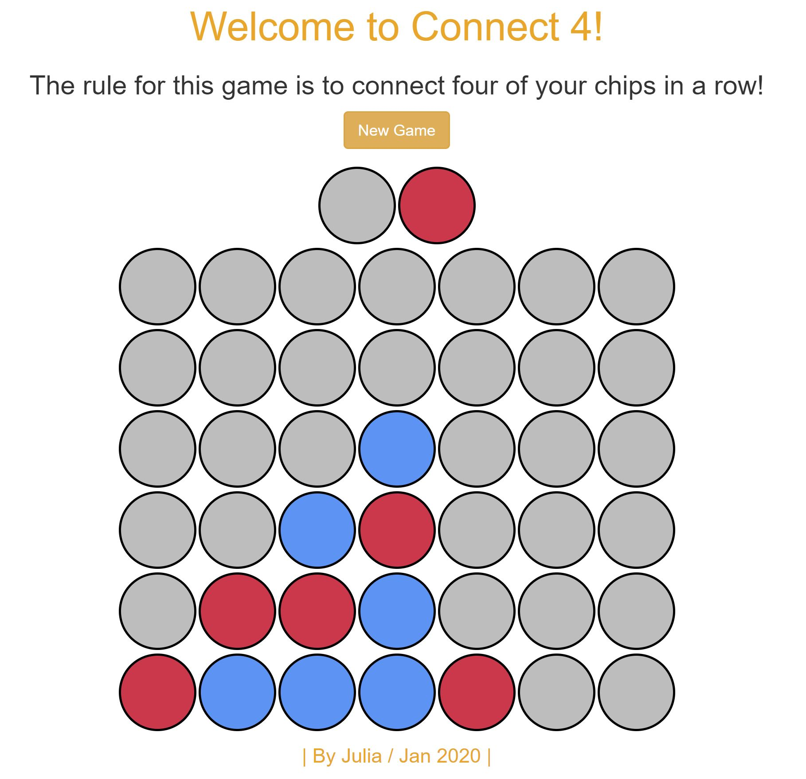

# Connect 4 : JavaScript Game

HTML, CSS, Bootstrap 3, JavaScript, JQuery 3.4.1

- The program is made to use JQuery for interacting with the DOM. For that, used the basic Events, Effect, CSS    

- The purpose of the game "CONNECT 4" is to connect four chips in a row for a player to win. 
- Players will put their chips in one by one from the bottom of the game board. 

- Game Feature

